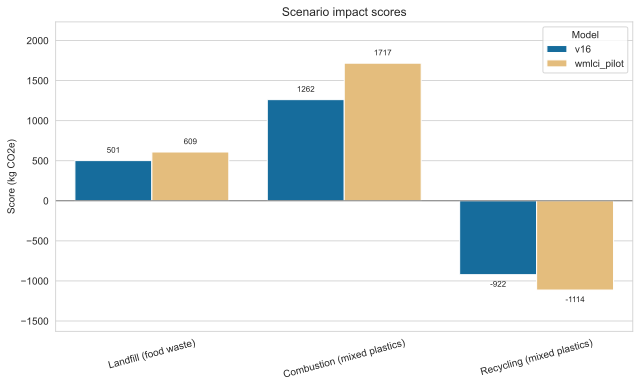
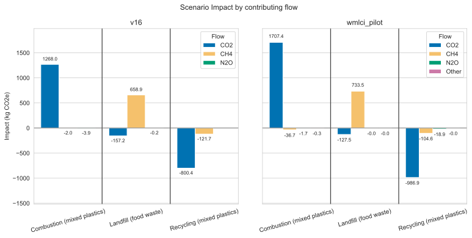
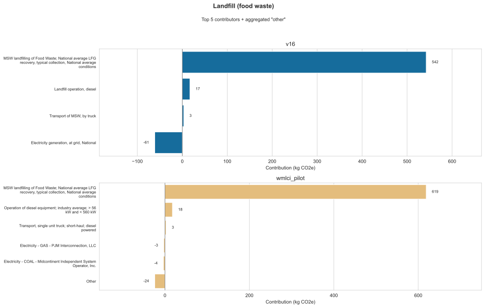
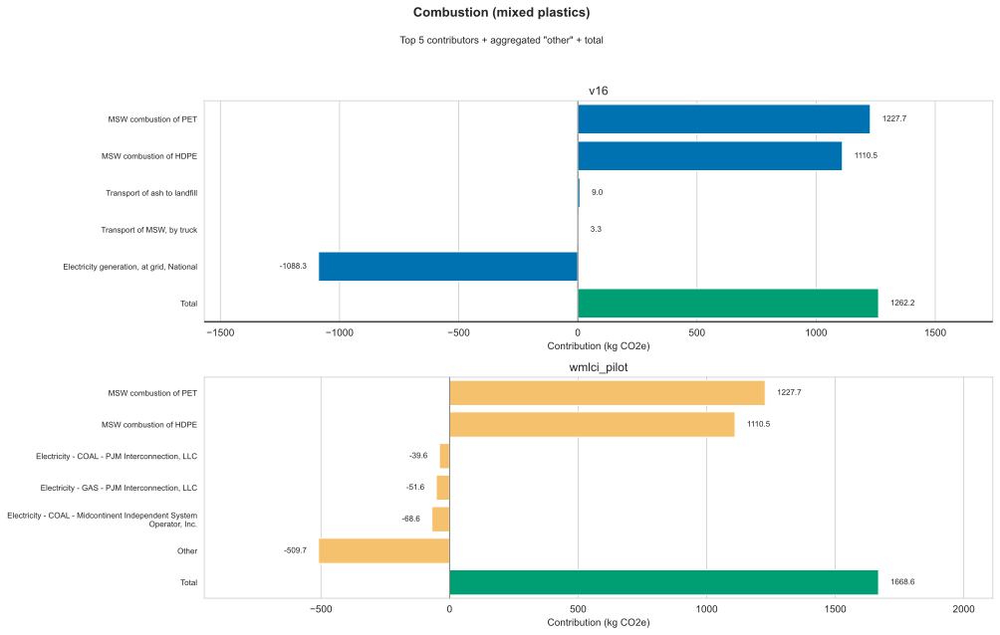
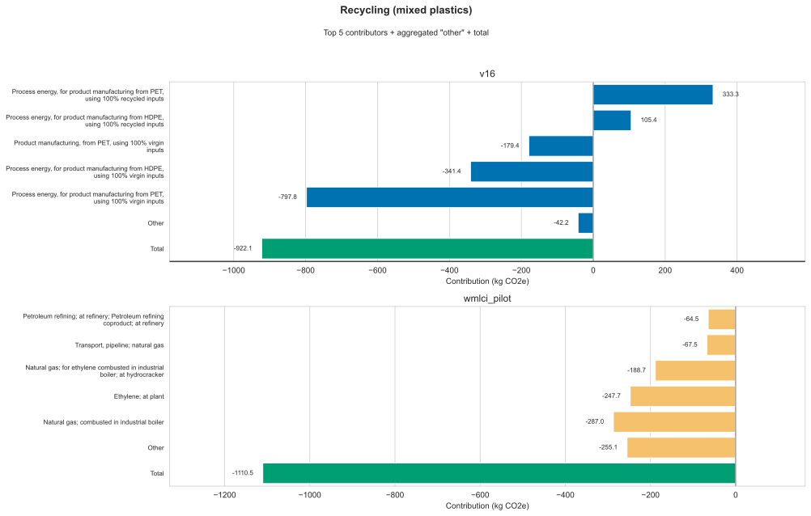
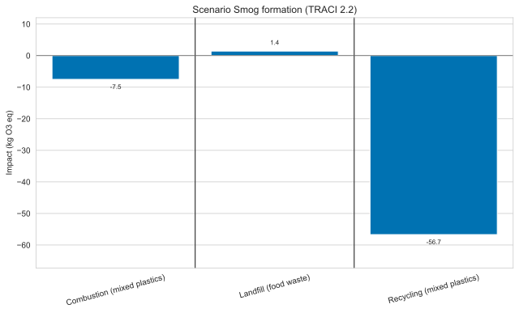
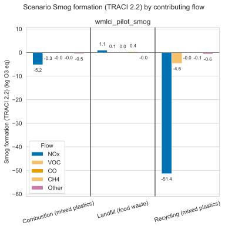
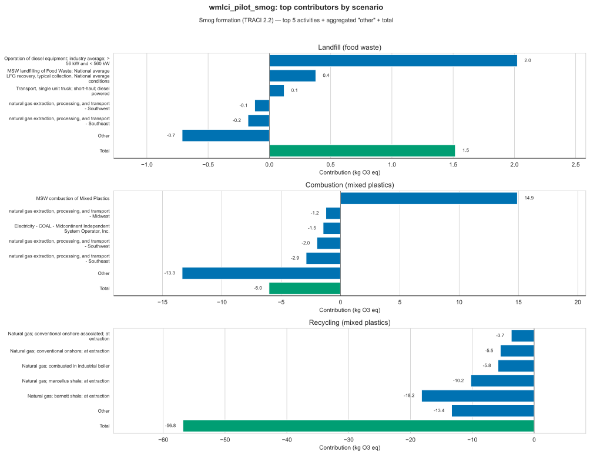

# Waste Management Life Cycle Inventory Model Assembler and Calculator (WMLCI) Result Exploration

This page compares model results for the LCA methods.
Method details are defined in [`data_and_methods.md`](data_and_methods.md).

This document compares the Global Warming Potential (GWP) results for methods `v16` vs `wmlci_pilot`. 
It also evaluates the results of the smog LCIA. 

## Global Warming Potential (GWP) analysis comparison: `v16` vs `wmlci_pilot`

Differences in GWP results between the two methods are due to:

1) **Inventory updates**: Updated Federal LCA Commons (FLCAC) data in the `wmlci_pilot` method
2) **LCIA updates**: `v16` is calculated using IPCC AR4-100 for GWP, while `wmlci_pilot` is built on AR6-100
3) **Grid Decarbonization**: Some of the changes in electricity are because the Waste Reduction Model v16 was released in 2022 and used older egrid data than the data used in `wmlci_pilot`

Functional unit for all scenarios: **1 US short ton** (907.18474 kg).

---

## Summary scores

| Scenario | v16 (kg CO₂e) | wmlci_pilot (kg CO₂e) | Δ (pilot − v16) | % vs \|v16\| |
|----------|---------------|------------------------|-----------------|--------------|
| Landfill (food waste) | 501 | 606 | **+105** | +21% |
| Combustion (mixed plastics) | 1,262 | 1,669 | **+406** | +32% |
| Recycling (mixed plastics) | −922 | −1,110 | **−188** | −20% |

In every scenario, the pilot model has a larger absolute score, which represents higher burdens for landfill and combustion, and a larger avoided-burden credit for recycling.

---

## Scenario GWP scores

**Figure 1.** Scenario GWP scores (`v16` vs `wmlci_pilot`).

- Grouped bars of total GWP for each scenario out of `v16` vs `wmlci_pilot`
- Positive = net GHG burden; negative = net credit (typical of recycling with virgin material displacement and possible with energy recovery in landfill and combustion)
- Values change across methods due to:
  1. Updated GWP factors (AR4-100 vs AR6-100)
  2. Updated background providers: FLCAC transport, electricity, landfill diesel, and plastics manufacturing (virgin and recycled)

---

## Scenario GWP by contributing flow

**Figure 2.** Scenario GWP by contributing flow (CO₂ / CH₄ / N₂O / Other), in kg CO₂e.

- Same scenario totals as Figure 1, split by emission types group (CO₂ / CH₄ / N₂O / Other).
- Groups defined by `characterized_flow_groups` in the method YAMLs.

---

## Top contributors

We assessed the values of the top 5 contributors to each modeling scenario, ranked by absolute values. 
The remaining data, outside the top 5 contributors, are aggregated into a combined "Other" category. 
A separate "Total" bar shows the full scenario score. 
The "Total" value is the overall model result and is the summed values of all the data included in the chart represented by the blue or yellow bars. 
If there are fewer than 5 contributors shown, or no "Other" than all data is captured in the bars that are graphed.

### Top contributors — landfill (food waste)

**Figure 3.** Top contributors — landfill (food waste).

- Per-model top activities by contribution, plus an “Other” residual for aggregated activities outside the top 5, and a "Total" bar (green) for the scenario score.
- Activity names do not align 1:1 across models (provider swaps + disaggregation).

Reasons for differences: 
1. **Foreground landfill process increases**:
   Fugitive CH₄ remains the main contributor. Main driver to the increase is switch from AR4 GWP 25 to AR6 ~29.8. This accounts for most of the landfill change.
2. **Electricity credit decreases (LFG energy recovery)**:
   `v16` uses a single Waste Reduction Model process “Electricity generation, at grid, National”.
   Switching to the FLCAC US electricity baseline has a lower carbon intensity.
3. **Landfill operation equipment**:
   Increases slightly due to new FLCAC dataset.

---

### Top contributors — combustion (mixed plastics)

**Figure 4.** Top contributors — combustion (mixed plastics).

- Stack CO₂ from PET/HDPE combustion vs avoided electricity from energy recovery (and minor transport).

Reasons for differences: 
1. **Direct combustion emissions are the same**:
   PET and HDPE match, due to the GWP = 1 in both models.
2. **Avoided electricity from energy recovery decreases**:
   The FLCAC dataset used in `wmlci_pilot` for national-average electricity has a lower carbon intensity than the data in `v16`. 

---

### Top contributors — recycling (mixed plastics)

**Figure 5.** Top contributors — recycling (mixed plastics).

- Net credit from displacing virgin plastic production with recycled material pathways.
- `v16` activities are Waste Reduction Model “process energy” / “product manufacturing” aggregates.
- Pilot activities are FLCAC/USLCI unit processes (natural gas boilers, ethylene, refining, etc.).

Reasons for differences: 
1. **Manufacturing provider update to USLCI**:
   Virgin and recycled PET/HDPE manufacturing are replaced with USLCI resin/pellet datasets. PET recycling has lower impacts, and virgin HDPE has higher impacts—both of which increase the displacement credit.
2. **Larger net CO₂ credit in pilot**
3. **Update to AR6 GWP factors**: 
    Rescales CH₄/N₂O portions of the credit. 

---

## Smog LCIA Results

TRACI 2.2 smog formation results for the `wmlci_pilot_smog` method, where the functional unit is 1 US short ton. 
There is no 'v16' comparison for this indicator, as the 'v16' Waste Reduction Model does not evaluate smog.

| Scenario | Smog (kg O₃ eq) |
|----------|----------------:|
| Landfill (food waste) |             1.4 |
| Combustion (mixed plastics) |            −7.5 |
| Recycling (mixed plastics) |           −56.7 |

Note that negative values are avoided-burden credits, not physical pollutant removals. 
Combustion credits displace grid electricity, while recycling credits displace virgin PET/HDPE manufacturing.

### Scenario smog scores

**Figure 6.** Scenario smog formation scores (`wmlci_pilot_smog`).

- Total smog formation (kg O₃ eq) for each scenario.
- Positive = net ozone-formation burden; negative = net credit (combustion energy recovery and recycling material displacement).

Across these life-cycle results, smog is almost entirely nitrogen oxides. 
Carbon monoxide, methane, and VOCs are in the inventory but are small shares of the characterized totals. 

### Scenario smog by contributing flow

**Figure 7.** Scenario smog by contributing flow (NOx / VOC / CO / CH₄ / Other), in kg O₃ eq.

- Same scenario totals as Figure 6, split by groups defined in `characterized_flow_groups` in [`wmlci_pilot_smog.yaml`](../wmlci/methods/wmlci_pilot_smog.yaml).
- NOx dominates all three scenarios. CO, CH₄, and VOCs appear on the chart but remain small relative to NOx.

### Top contributors

**Figure 8.** Top contributors by scenario (`wmlci_pilot_smog`).

- One panel per scenario: top 5 activities by contribution, plus an “Other” for the remaining aggreated data, and a "Total" bar (green) for the scenario impact

Combustion has positive NOx emissions in the main MSW combustion stage, which influence the +14.9 kg O₃ eq on MSW combustion of mixed plastics before energy-recovery credits move the total to −7.5. 
That split matters because smog is regional, with communities near the incinerator impacted by smog, while avoided electricity credits accrue where the utilities operate.
