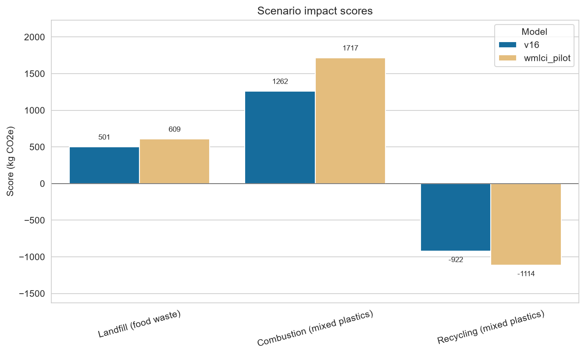
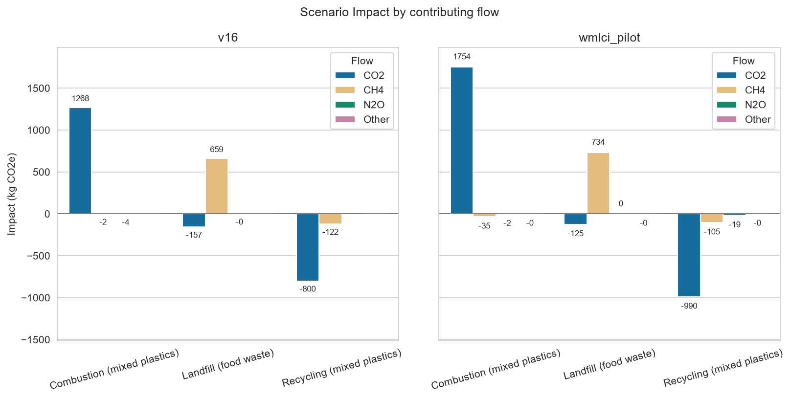
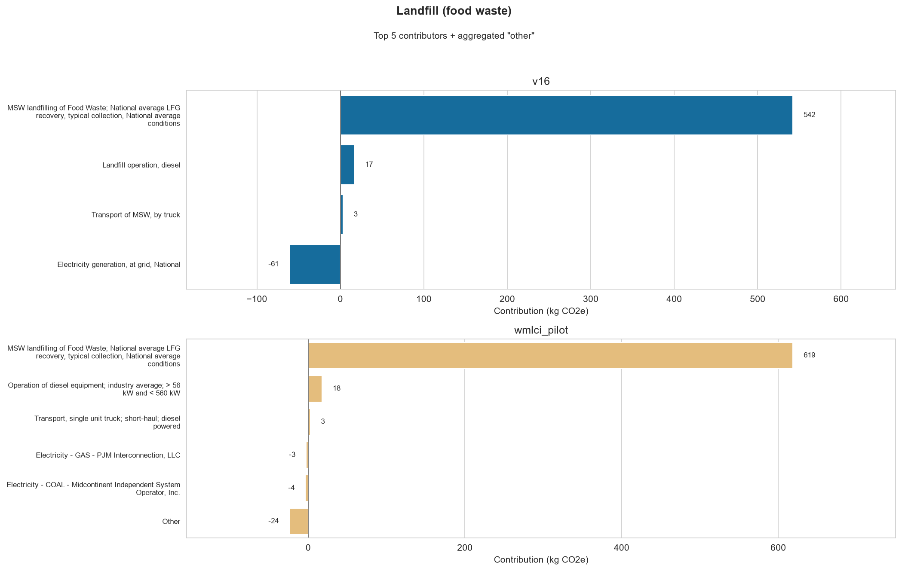
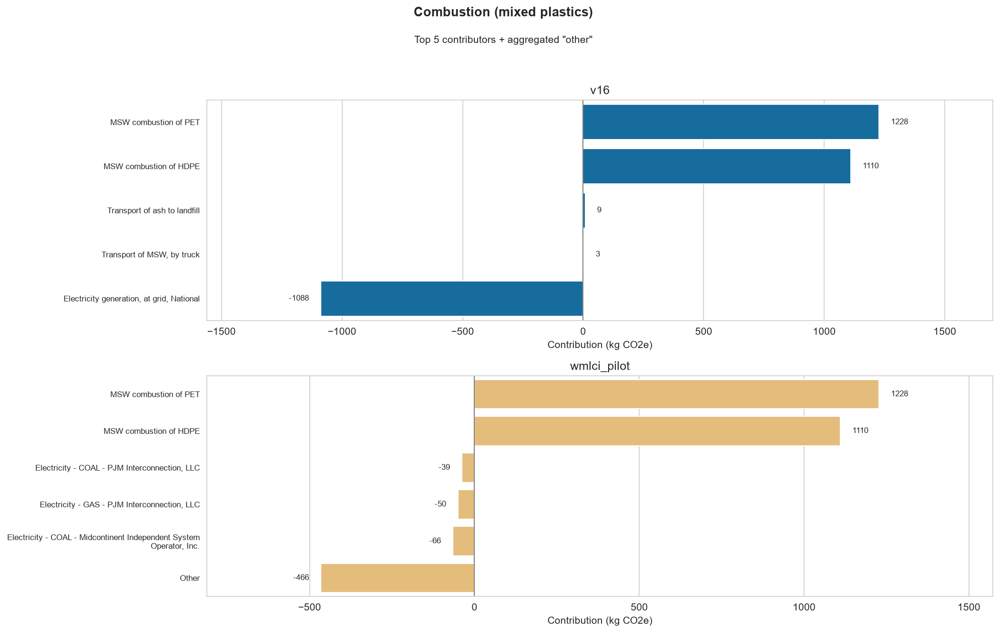
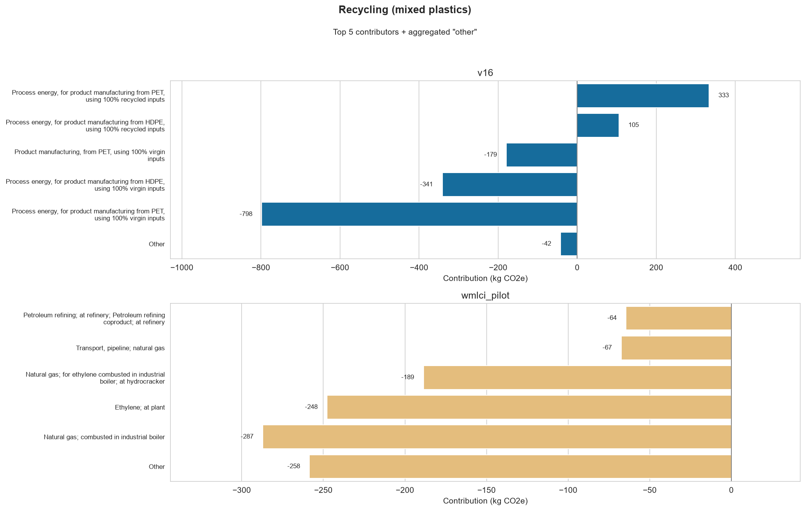

# Result documentation: v16 vs wmlci_pilot

This page describes the comparison graphics for the LCA methods and explains why the scores differ.
Methods details are in [`method_and_data_documentation.md`](data_and_method_documentation).

Differences in results between the two methods are due to:

1) **Inventory updates** updated FLCAC data in the `wmlci_pilot` method
2) **LCIA updates** `v16` is calculated using IPCC AR4-100, while `wmlci_pilot` is built on AR6-100

Functional unit for all scenarios: **1 US short ton** (907.18474 kg).

---

## Summary scores

| Scenario | v16 (kg CO₂e) | wmlci_pilot (kg CO₂e) | Δ (pilot − v16) | % vs \|v16\| |
|----------|---------------|------------------------|-----------------|--------------|
| Landfill (food waste) | 501 | 609 | **+107** | +21%         |
| Combustion (mixed plastics) | 1,262 | 1,717 | **+455** | +36%         |
| Recycling (mixed plastics) | −922 | −1,114 | **−192** | −21%        |

In every scenario, pilot has a **larger absolute** score: higher burdens for landfill and combustion, and a larger avoided-burden credit for recycling.

---

## Scenario GWP scores

**Figure 1.** Scenario GWP scores (`v16` vs `wmlci_pilot`).

- Grouped bars of total GWP for each scenario under `v16` vs `wmlci_pilot`.
- Positive = net GHG burden; negative = net credit (typical of recycling with virgin material displacement).
- Values change across methods due to:
  1. Updated GWP factors — AR4-100 vs AR6-100
  2. Updated background providers — pilot replaces Waste Reduction Model v16 transport, electricity, landfill diesel, and plastics manufacturing with FLCAC datasets (see method doc).

---

## Scenario GWP by contributing flow

**Figure 2.** Scenario GWP by contributing flow (CO₂ / CH₄ / N₂O / Other), in kg CO₂e.

- Same scenario totals as Figure 1, split by emission types group (CO₂ / CH₄ / N₂O / Other).
- Groups defined by `characterized_flow_groups` in the method YAMLs.

---

## Top contributors

We assessed the values of the top 5 contributors to each modeling scenario, ranked by the absolute values. 
The remaining data, outside the top 5 contributors, are aggregated into a combined "Other" category and included in the graphics. 
This way the graphics still include total emissions for each modeling scenario, but it is clear what is driving the results. 
If there are fewer than 5 contributors shown, or no "Other" than all data is captured in the bars that are graphed.

### Top contributors — landfill (food waste)

**Figure 3.** Top contributors — landfill (food waste).

- Per-model top activities by |contribution|, plus an “Other” residual for aggregated activities outside the top 5.
- Activity names do not align 1:1 across models (provider swaps + disaggregation).

Reasons for differences:

1. **Foreground landfill process rises (~542 → ~619)**
   Fugitive CH₄ is still the main contributor.
   Characterized CH₄ inventory mass is ~26 kg in both runs; applying GWP 25 vs ~29.8 moves CH₄ from ~659 to ~734 kg CO₂e.
   That alone accounts for most of the landfill delta.
2. **Electricity credit shrinks**
   v16 uses a single Waste Reduction Model process “Electricity generation, at grid, National” (−61).
   Pilot swaps to FLCAC US electricity baseline, which appears as many regional/fuel activities (e.g. MISO coal, PJM gas) with a **much smaller net credit** on the top bars (−4 / −3) plus Other.
3. **Diesel / transport providers renamed but similar magnitude**
   “Landfill operation, diesel” → heavy-equipment diesel (~17 → ~18); MSW truck → USLCI short-haul (~3 in both).
   These are not the main score drivers.

---

### Top contributors — combustion (mixed plastics)

**Figure 4.** Top contributors — combustion (mixed plastics).

- Stack CO₂ from PET/HDPE combustion vs avoided electricity from energy recovery (and minor transport).

Reasons for differences:

1. **Direct combustion emissions are the same**
   PET (~1,228) and HDPE (~1,110) match in both models — GWP 1 in both models.
2. **Avoided electricity credit is much smaller in pilot**
   v16: one national-grid credit **−1,088**.
   Pilot: US electricity baseline disaggregated into many generators; top coal/gas bars are only tens of kg each, and even with “Other” (~−466) the **total electricity offset is substantially less** than −1,088.
   Net effect: same stack CO₂, less credit → higher GWP (~1,262 → ~1,717).
3. **Transport** remains small in v16 (+3 truck, +9 ash); in pilot those sit in the long tail (“Other”).

Combustion differences are driven primarily by the electricity technosphere update, not by plastic combustion factors.

---

### Top contributors — recycling (mixed plastics)

**Figure 5.** Top contributors — recycling (mixed plastics).

- Net credit from displacing virgin plastic production with recycled material pathways.
- v16 activities are Waste Reduction Model “process energy” / “product manufacturing” aggregates.
- Pilot activities are FLCAC/USLCI unit processes (natural gas boilers, ethylene, refining, etc.).

Reasons for differences:

1. **Manufacturing provider swap**
   Virgin and recycled PET/HDPE manufacturing are replaced with USLCI resin/pellet datasets.
   Contribution charts therefore show chemical/energy supply chains instead of Waste Reduction Model process-energy buckets.
2. **Net CO₂ credit increases** (−800 → −990 characterized)
   Updated virgin-displacement burdens (and recycled pathway burdens) do not cancel the same way as in Waste Reduction Model aggregates.
3. **MSW truck transport dropped** in the recycling update YAML (collection treated as already in recycled FLCAC datasets) — small vs manufacturing, but intentional scope change.
4. **AR6 factors** also rescale CH₄/N₂O portions of the credit (pilot shows a visible N₂O credit; v16 N₂O ~0 in the characterized rollup).
